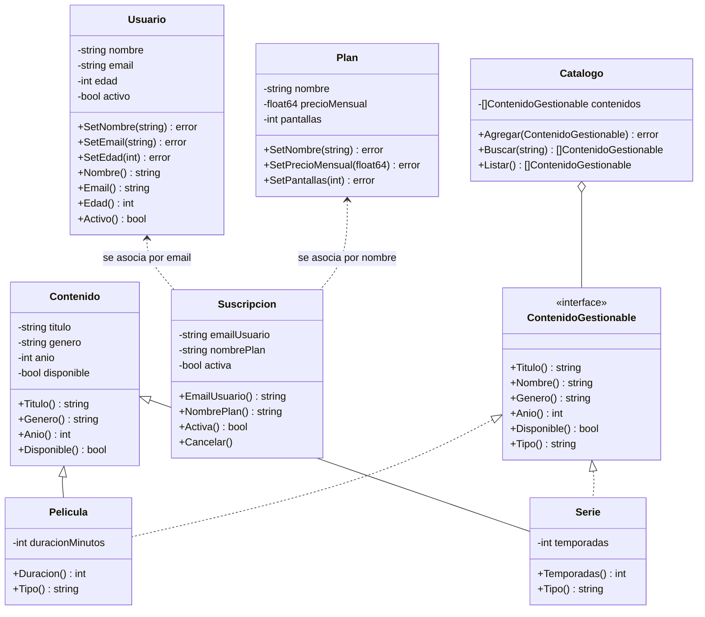

# Diagrama de clases

```mermaid
classDiagram
    class Usuario {
        -string nombre
        -string email
        -int edad
        -bool activo
        +SetNombre(string) error
        +SetEmail(string) error
        +SetEdad(int) error
        +Nombre() string
        +Email() string
        +Edad() int
        +Activo() bool
    }

    class Plan {
        -string nombre
        -float64 precioMensual
        -int pantallas
        +SetNombre(string) error
        +SetPrecioMensual(float64) error
        +SetPantallas(int) error
    }

    class Contenido {
        -string titulo
        -string genero
        -int anio
        -bool disponible
        +Titulo() string
        +Genero() string
        +Anio() int
        +Disponible() bool
    }

    class Pelicula {
        -int duracionMinutos
        +Duracion() int
        +Tipo() string
    }

    class Serie {
        -int temporadas
        +Temporadas() int
        +Tipo() string
    }

    class Suscripcion {
        -string emailUsuario
        -string nombrePlan
        -bool activa
        +EmailUsuario() string
        +NombrePlan() string
        +Activa() bool
        +Cancelar()
    }

    class ContenidoGestionable {
        <<interface>>
        +Titulo() string
        +Nombre() string
        +Genero() string
        +Anio() int
        +Disponible() bool
        +Tipo() string
    }

    class Catalogo {
        -[]ContenidoGestionable contenidos
        +Agregar(ContenidoGestionable) error
        +Buscar(string) []ContenidoGestionable
        +Listar() []ContenidoGestionable
    }

    Usuario <.. Suscripcion : se asocia por email
    Plan <.. Suscripcion : se asocia por nombre
    Contenido <|-- Pelicula
    Contenido <|-- Serie
    ContenidoGestionable <|.. Pelicula
    ContenidoGestionable <|.. Serie
    Catalogo o-- ContenidoGestionable
```

El diseño refleja la encapsulación de los modelos, la composición de contenidos y el polimorfismo del catálogo mediante una interfaz común.
